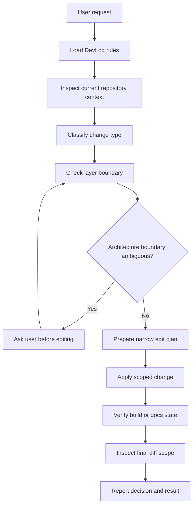
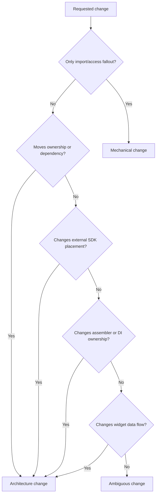
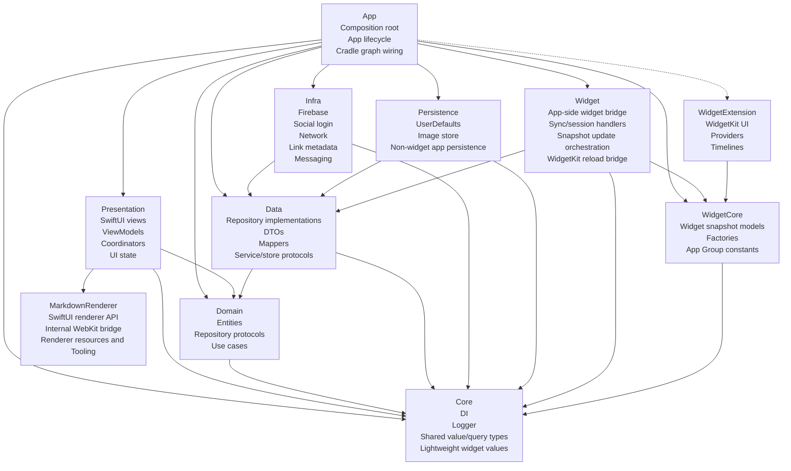
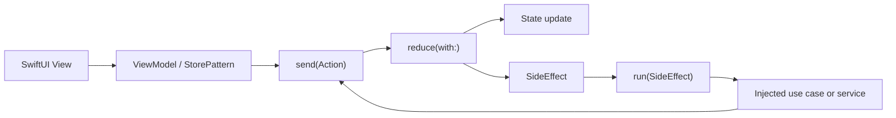
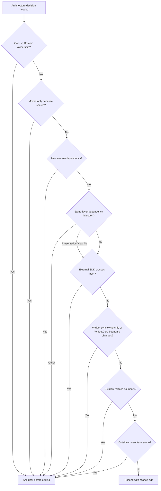
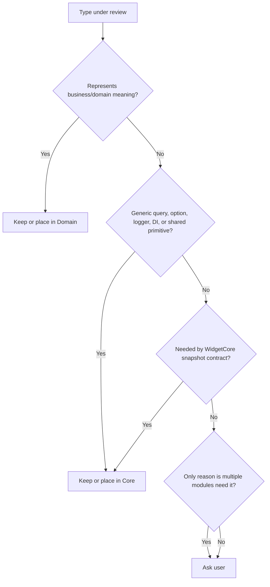
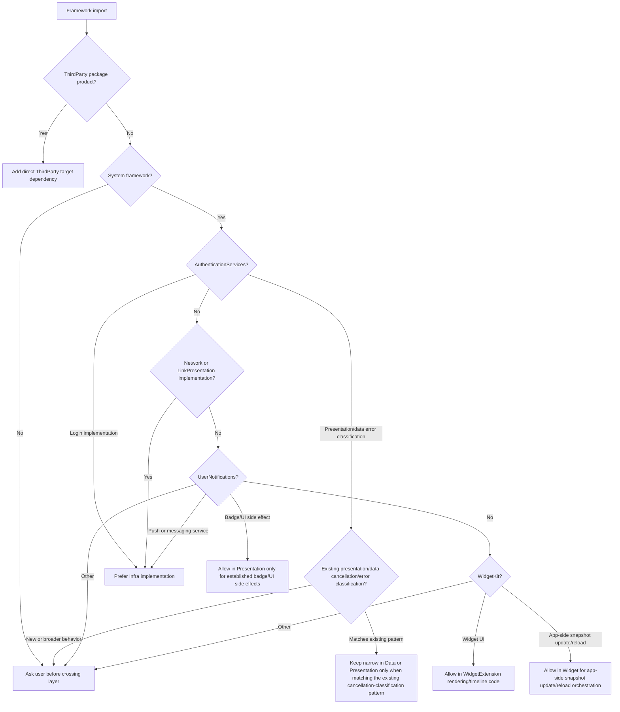
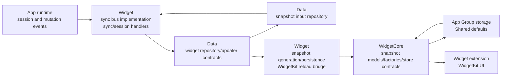
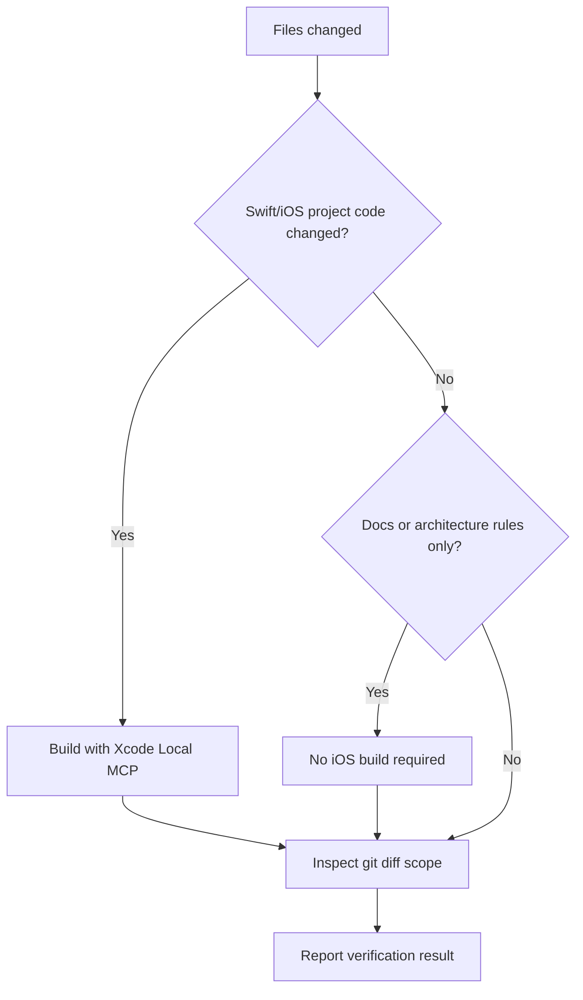

# DevLog Architecture Rules

## Purpose

This reference defines the DevLog-specific flow and boundaries for AI-assisted architecture work.

The goal is not to make the AI decide more architecture policy. The goal is to make the AI stop before it makes project-specific architecture decisions that should be confirmed by the user.

Use this reference with `AGENTS.md`, `.agents/rules/general.md`, and `.agents/roles.md`.

This repository is a Tuist-generated, workspace-based modular iOS app. There is no root `Package.swift`; module projects are generated from `Workspace.swift` and each module's `Project.swift`.

`ThirdParty` is an external package registry, not a DevLog application layer. It owns Swift Package declarations and product linkage only, has no DevLog target dependency, and any target including `Domain` may depend on it when that target imports an external package product.

## When to use

Read this file before work that changes any of these areas:

- Module boundaries or file ownership across `Application/*`, `Libraries/*`, and `Widget/*` targets.
- Swift imports or Tuist target dependencies.
- DI graph wiring or same-layer dependency injection.
- Repository, service, store, or use case contracts.
- Firebase, social login, network, link metadata, notification, or WidgetKit dependency placement.
- Widget snapshot, App Group, or widget deep-link data flow.
- Architecture diagrams, README architecture text, or PR architecture explanations.

Before editing, also read `README.md`. Read `.agents/rules/project-workflows.md` when the task involves PR review, commits, Xcode project files, CI, widgets, Store reducers, localization, release, or build tooling.

Then inspect the concrete files, Swift imports, and Tuist target dependencies related to the requested change. Do not rely on layer names alone.

## Mandatory flow

1. Identify the changed layer and owning target before editing.
2. Inspect the current Swift import direction and Xcode target/framework dependency before deciding.
3. Classify the change as mechanical, architectural, or ambiguous.
4. Stop and ask the user before editing when the architecture boundary is ambiguous.
5. Keep the diff limited to the requested architecture scope.
6. Follow `.agents/rules/project-workflows.md` for verification after Swift or iOS project changes.
7. Report the changed files, architecture decision, verification result, and unresolved user decisions.

## Safe mechanical changes

These may proceed after inspection when they do not change architecture meaning:

- Removing unused imports.
- Updating import statements after an already-approved file move.
- Fixing access control needed by an already-approved module boundary.
- Updating tests to match an already-approved public contract.
- Editing docs to reflect the current verified architecture.

## High-level architecture flow

## Change classification

## DevLog layer map

## Boundary rules

| Layer | Owns | Allowed direction | Ask before |
| --- | --- | --- | --- |
| `ThirdParty` | external package declarations, product linkage, marker sources | No DevLog target dependency; may be depended on by any target | Adding DevLog feature, service, adapter, or layer dependency; changing package versions or products outside the requested scope |
| `Core` | logger, shared value/query types, display options, activity kinds, lightweight widget bridge values | No DevLog layer dependency; `ThirdParty` when needed | Moving domain entities into Core |
| `Domain` | entities, repository protocols, use cases | Core, `ThirdParty` when needed | Adding Data, Infra, Persistence, Presentation, App, or Widget UI dependency |
| `Data` | repository implementations, DTOs, mappers, data protocols, widget repository/updater/sync contracts | Domain, Core, `ThirdParty` when needed | Adding WidgetKit, storage, WidgetCore snapshot model/factory usage, or platform implementation details; moving concrete widget handlers into Data |
| `Infra` | application infrastructure service implementations for social login, network, metadata, and messaging | Data, Core, `ThirdParty` when needed | Adding any Domain dependency or SDK service contract coupling |
| `Persistence` | local stores, image cache, non-widget app persistence | Data, Core, `ThirdParty` when needed | Adding WidgetCore, WidgetKit reload, Widget, widget snapshot generation, or widget bridge ownership |
| `Presentation` | UI, view models, coordinators, presentation state, narrow presentation-scoped platform side effects | Domain, Core, `ThirdParty` when needed | Adding Data, Infra, Persistence, or App dependency; expanding platform service ownership beyond UI-side effects |
| `MarkdownRenderer` | public SwiftUI renderer and reference value, internal WebKit bridge, renderer resources, TypeScript Tooling, renderer tests | system frameworks, `ThirdParty` when needed | Adding a DevLog application layer dependency, exposing WebKit bridge types, adding another Presentation importer, or re-exporting the module |
| `Widget` | app-side widget bridge, sync bus implementation, sync/session handlers, snapshot generation/persistence orchestration, WidgetKit reload bridge, provider graph | Data, Core, WidgetCore, `ThirdParty` when needed | Adding Domain, Infra, Persistence, Presentation, or App dependency |
| `App` | composition root, lifecycle, Cradle graph wiring, app target ownership for widget extension embedding | Concrete app layers, `ThirdParty` for framework linking | Moving feature logic into App |
| `WidgetCore` | widget snapshot models, factories, app-group keys/defaults store, deep links, pure snapshot logic | Core, `ThirdParty` when needed | Adding Domain, Data, Infra, Persistence, Presentation, App, or Widget dependency |
| `WidgetExtension` | WidgetKit rendering and timeline plumbing | WidgetCore, `ThirdParty` when needed | Calling app/domain services directly |

## Presentation target structure

- `Presentation` preserves `App -> Presentation` imports and re-exports the entry API through `Application/Presentation/Sources/**/*.swift`.
- `Entry` owns root, auth, login, main tab shell, window, and global route responsibilities. It owns the `Domain` references needed by those flows.
- `EntryTests` validates `Entry` through `Application/Presentation/Entry/Tests/**/*.swift`.
- `HomeTab`, `TodayTab`, `NotificationTab`, and `ProfileTab` remain tab-specific feature targets and each target owns the `Domain` references it needs.
- `PresentationShared` owns shared Todo, Search, Loading UI, and presentation contracts.
- `App` owns composition root, lifecycle, and Cradle graph wiring. It must not take ownership of presentation feature or root flows.

## MarkdownRenderer module boundary

- `Libraries/MarkdownRenderer` owns `MarkdownRendererView`, `MarkdownRendererReference`, the internal `MarkdownWebView` and Coordinator, URL/message policy, renderer resources, renderer tests, and TypeScript Tooling.
- `MarkdownRenderer` may depend on system frameworks such as `SwiftUI`, `WebKit`, `Foundation`, and `CoreGraphics`. It must not import `Core`, `Domain`, `Data`, `Infra`, `Persistence`, `Presentation`, `App`, `Widget`, or `WidgetCore`.
- `PresentationShared` depends on `MarkdownRenderer`. `Application/Presentation/PresentationShared/Sources/Common/TodoMarkdownContentView.swift` is the only direct Presentation importer and must not use `@_exported import MarkdownRenderer`.
- `TodoMarkdownContentView` owns `TodoReferenceItem` conversion, symbol image data URL creation, tab bar and safe-area adaptation, and `onOpenTodoID` callback adaptation. These DevLog concerns must not move into `MarkdownRenderer`.
- `MarkdownRendererView` owns color scheme, locale, external URL opening, scaled font size, and the public renderer input. The internal `MarkdownWebView` keeps `WKWebView` lifecycle, message handling, internal scroll ownership, and `obscuredContentInsets.bottom` handling out of the public API.
- `Libraries/MarkdownRenderer/Tooling` generates the tracked files under `Libraries/MarkdownRenderer/Resources/MarkdownRenderer`. CI must verify that generated and tracked resources remain synchronized.

## Layer-internal dependency injection

Do not inject dependencies between types that belong to the same layer.

This rule covers initializer injection, stored-property injection, environment injection, and resolving same-layer types through a runtime resolver.

The only allowed exception is a SwiftUI `View` file in `Application/Presentation` receiving same-layer presentation objects such as a ViewModel, Coordinator, or Store for UI composition.

That exception does not apply to non-View files in Presentation, and does not apply to Core, Domain, Data, Infra, Persistence, Widget, App, WidgetCore, or WidgetExtension.

## Presentation StorePattern flow

Preserve this flow unless the user explicitly asks to change the Presentation architecture. Reducers compute state and return side effects. I/O belongs in `run` or injected services.

## Ambiguity gate

The AI must stop and ask the user when it reaches any of these points.

## Core vs Domain decision flow

Use this flow when deciding whether a type belongs in Core or Domain.

## System framework and ThirdParty dependency flow

Use this flow before introducing or moving framework imports. A Swift Package product declared by `ThirdParty` is available to any target including `Domain`; it requires that target's direct `ThirdParty` dependency but does not change DevLog layer ownership.

## Widget data-flow boundary

Widget UI should consume snapshot data. It should not fetch app services or domain repositories directly.

## Verification flow

## Required working notes

Before editing architecture code, the AI should be able to answer these questions:

1. What layer owns the changed concept today?
2. What layer should own it after the change?
3. Which imports prove the current dependency direction?
4. Which target dependency will change?
5. Does the change add a `ThirdParty` dependency or move DevLog behavior into `ThirdParty`?
6. Does the change affect WidgetCore or WidgetExtension boundaries?
7. Is this change inside the current issue or PR scope?
8. Is user confirmation required before editing?

## Completion checklist

- DevLog-specific rules were loaded.
- Current files and imports were inspected.
- Ambiguous architecture decisions were confirmed by the user.
- `ThirdParty` remains free of DevLog target dependencies and application behavior.
- Swift logic was preserved unless explicitly approved.
- Diff scope was checked.
- Xcode Local MCP build was used for Swift/iOS code changes.
- Docs-only or architecture-rule-only changes were reported as such, without claiming app build verification.
