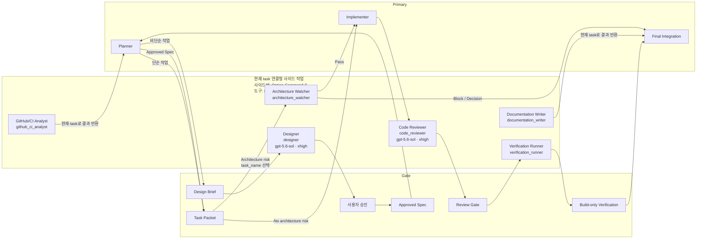

# DevLog

> 개발 기록과 Todo를 한 곳에서 관리하는 SwiftUI 기반 앱  
> 저장한 링크, 작업 메모, 마감 일정, 개인 활동 흐름을 하나의 앱 안에서 정리하는 구조

<table>
  <tr>
    <td align="center" width="20%">
      
    </td>
    <td align="center" width="20%">
      
    </td>
    <td align="center" width="20%">
      
    </td>
    <td align="center" width="20%">
      
    </td>
    <td align="center" width="20%">
      
    </td>
  </tr>
  <tr>
    <td align="center">홈</td>
    <td align="center">마크다운 작성</td>
    <td align="center">오늘 기준 Todo 확인</td>
    <td align="center">푸시 알림</td>
    <td align="center">히트맵</td>
  </tr>
</table>

<table>
  <tr>
    <td align="center" width="50%">
      
    </td>
    <td align="center" width="50%">
      
    </td>
  </tr>
  <tr>
    <td align="center">로그인</td>
    <td align="center">홈</td>
  </tr>
</table>

## 앱 사용해보기

<a href="https://apps.apple.com/us/app/devlog/id6760288611">
  
</a>

## 프로젝트 개요

개발 과정에서 해야 할 일, 참고 링크, 진행 기록이 여러 곳에 흩어지기 쉬운 문제 해결 목적  
Todo, 저장 링크, 오늘 할 일, 받은 알림, 누적 활동을 하나의 화면 흐름 안에서 함께 관리할 수 있도록 구성한 앱

- Todo 유형별 정리 및 빠른 탐색
- Markdown, 태그, 마감일, 중요 표시를 포함한 Todo 작성
- 웹 페이지 저장 및 재열람
- 오늘 기준 우선 확인 Todo 요약
- 받은 푸시 알림 확인 및 Todo 연계
- 분기별 활동 히트맵 제공
- Google, GitHub, Apple 로그인 및 계정 연동

## 아키텍처

- `DevLog.xcworkspace` 안에서 Application, Libraries, Widget 모듈을 분리하고 화면, 상태, 비즈니스 로직, 외부 의존성 경계를 나눈 `Clean Architecture` 기반 구성
- `Domain`을 중심으로 계층별 책임과 의존 방향을 분리해 비즈니스 규칙이 UI, 데이터 저장소, 외부 SDK 구현에 의존하지 않도록 구성
- `ThirdParty` target은 Swift Package 선언과 product 링크만 소유하는 계층 외부 registry이며 필요한 target이 선택적으로 의존함
- `Presentation` target은 `App`의 기존 import를 유지하는 re-export 역할
	- `Entry`: root/auth/tab shell/window 흐름 소유
	- `PresentationShared`: 공통 Todo/Search/Loading 흐름 소유
	- `HomeTab`, `TodayTab`, `NotificationTab`, `ProfileTab`: 탭 단위 흐름 소유
- `MarkdownRenderer` target은 SwiftUI 공개 화면과 참조 값, 내부 `WKWebView` 연결, HTML/JavaScript/CSS 자원과 TypeScript Tooling을 소유함
- `PresentationShared`에서는 `TodoMarkdownContentView`만 `MarkdownRenderer`를 직접 import하며 재노출하지 않음

<table>
  <tr>
    <td align="center">
      
    </td>
  </tr>
  <tr>
    <td align="center">Tuist 모듈 의존성 그래프</td>
  </tr>
</table>

## 주요 기능

### 로그인 및 계정 관리

- Google, GitHub, Apple 로그인 지원
- 설정 화면에서 계정 연동 및 해제 관리
- 앱 내부 로그아웃 및 회원 탈퇴 흐름 제공
- Firebase Authentication 기반 사용자 세션 관리

### Home

- 작업 성격별 Todo 유형 진입점 제공
- Home에서 Todo 유형 노출 여부 및 순서 편집
- 최근 수정 Todo 별도 섹션 제공
- 저장한 웹 페이지 목록 확인 및 즉시 열람
- URL 입력 시 메타데이터 수집 후 제목과 썸네일 저장

### Todo 관리

- 8개 Todo 유형별 목록, 정렬, 완료 상태, 중요 표시 필터 지원
- Todo 목록 내 검색과 페이지네이션 기반 로드
- 스와이프 액션을 통한 중요 표시, 완료 처리, 삭제 지원
- Markdown, 태그, 마감일, 중요 표시 기반 Todo 작성 및 수정
- 상세 화면에서 생성일, 완료일, 마감일, 태그 확인

### Today

- 남은 일, 집중 Todo, 지연 Todo, 7일 내 마감 Todo 요약 카드 제공
- 집중할 일, 지난 마감, 나중 일정, 일정 미정 등 기한 기준 섹션 분류
- 보기 범위와 중요 표시 조건 기반 빠른 필터링
- 항목별 스와이프 액션을 통한 중요 표시 및 완료 처리

### 알림

- 받은 푸시 알림 목록 확인
- 정렬, 기간, 읽지 않음 기준 필터링
- 알림 선택 시 연결된 Todo 상세 확인 및 읽음 처리
- 페이지네이션 및 실시간 동기화 기반 알림 목록 갱신
- 사용자 설정 시각 기준으로 다음 날 마감 Todo 리마인드 푸시 발송

### 검색

- Home 화면 검색 버튼을 통한 통합 검색 진입
- Todo와 저장한 웹 페이지 통합 검색
- 디바운스 기반 검색 처리
- 최근 검색어 저장, 개별 삭제, 전체 삭제 지원

### 프로필 및 설정

- 상태 메시지 직접 수정
- 분기 이동 및 직접 선택, 생성/완료 활동 필터 기반 히트맵 제공
- 테마 변경, 푸시 알림 시간 설정, 캐시 정리 기능 제공
- 설정 화면에서 앱 버전, 개인정보 처리방침, 베타 테스트 링크 확인

---

## 기술 스택

| 구분 | 스택 |
| --- | --- |
| Deployment Target | iOS / iPadOS 17.0+ |
| Platform Support | iPhone, iPad, Apple Silicon Mac (App Store, Designed for iPad) |
| Architecture | Tuist Modular based Clean Architecture |
| UI | SwiftUI, WidgetKit, AppIntents |
| State & Async | Observable, Combine, async/await, The Composable Architecture |
| Backend | Firebase Authentication, Firestore, Cloud Functions, Cloud Messaging |
| Monitoring | Firebase Analytics, Crashlytics |
| Apple Frameworks | AuthenticationServices, UserNotifications, LinkPresentation, Network, CryptoKit, os.log |
| External Packages | ComposableArchitecture, OrderedCollections, GoogleSignIn, Nexa |
| Testing | swift-testing, TCA TestStore |
| Tooling | Xcode, Tuist, mise, Swift Package Manager, SwiftLint, Fastlane |

## 개발 환경 구성

- Xcode 프로젝트와 워크스페이스는 Tuist manifest를 기준으로 생성하며 Git은 생성물을 추적하지 않음
- `.mise.toml`에서 Tuist 버전을 고정
- `Workspace.swift`, 각 모듈의 `Project.swift`, `Tuist/ProjectDescriptionHelpers`가 Xcode 프로젝트 생성 기준
- Swift Package 의존성은 Tuist 생성 과정에서 `.spm/` 아래로 resolve

### 환경 버전

| 항목 | 버전 |
| --- | --- |
| Xcode | 26.5 |
| iOS Deployment Target | 17.0 |
| Swift | 5.0 |
| Tuist | 4.194.4 |
| SwiftLint | 0.63.3 |
| Ruby | 3.4.7 |
| Bundler | 2.7.2 |
| Fastlane | 2.232.2 |

### 1. 도구 설치

```bash
brew install mise
brew install swiftlint
mise install
```

### 2. 비공개 설정 파일 준비

앱 실행에 필요한 비공개 설정 파일은 리포지토리에 포함되지 않음

```text
Application/App/Sources/Resource/
├── Config.xcconfig
└── GoogleService-Info.plist
```

Firebase 프로젝트와 Firestore database는 build configuration 기준으로 분리함

```text
Debug, Staging -> staging Firebase project / Firestore (default)
Release -> prod Firebase project / Firestore (default)
```

- TestFlight archive는 `Staging`, App Store 실제 서비스 archive는 `Release` configuration을 사용함
- GitHub Actions 배포 workflow는 PR label 기반 자동 실행 없이 수동 실행함
- TestFlight build는 App Store 심사 제출 대상으로 승격하지 않고, 실제 배포는 같은 `MARKETING_VERSION`의 별도 `Release` configuration build로 생성함
- build number는 TestFlight와 App Store upload가 공유하는 App Store Connect build number 공간에서 자동 증가함

- TestFlight build: `bundle exec fastlane testflight_build_only`
- TestFlight upload: `bundle exec fastlane deploy_testflight`
- App Store build: `bundle exec fastlane appstore_build_only`
- App Store upload: `bundle exec fastlane deploy_appstore`

### 3. Xcode 워크스페이스 생성

```bash
mise exec -- tuist generate --no-open
```

### 4. 빌드 확인

- Xcode에서 `DevLog.xcworkspace` 열기
- `App` 스킴 선택
- iOS Simulator 선택 후 Build 실행

`Project.swift`, `Workspace.swift`, `Tuist/ProjectDescriptionHelpers`를 수정한 경우 다시 워크스페이스 생성 명령 실행.


## 프로젝트 구조

```text
DevLog_iOS/
├── Tuist.swift
├── Workspace.swift
├── .mise.toml
├── Tuist/
│	└── ProjectDescriptionHelpers/ # Tuist 공통 패키지, 설정, 타깃 템플릿
├── Application/
│	├── App/                   # 앱 진입점, 앱 생명주기, 라우팅, Cradle graph 조립
│	├── Core/                  # Logger, Query, 공통 값 타입
│	├── Domain/                # Entity, Repository Protocol, UseCase
│	├── Data/                  # Repository 구현, DTO, Mapper, Data 계층 Protocol
│	├── Infra/                 # Firebase, 소셜 로그인, 네트워크, 메타데이터 서비스 구현
│	├── Persistence/           # UserDefaults, 이미지 저장소, 앱 로컬 영속성 처리
│	├── Presentation/          # Presentation project, re-export/shared/entry/tab target 구성
│	│	├── Sources/            # Presentation target re-export source
│	│	├── Entry/              # root/auth/tab shell/window target
│	│	├── PresentationShared/ # 공통 Todo/Search/Loading UI, 공통 presentation structure
│	│	├── HomeTab/           # Home 탭 화면, feature, coordinator, 테스트
│	│	├── TodayTab/          # Today 탭 화면, feature, coordinator, 테스트
│	│	├── NotificationTab/   # Notification 탭 화면, feature, coordinator, 테스트
│	│	└── ProfileTab/        # Profile/Settings 탭 화면, feature, coordinator, 테스트
│	└── Widget/                # 앱-위젯 브릿지, 위젯 동기화 이벤트, 스냅샷 갱신
├── Libraries/
│	├── MarkdownRenderer/      # 독립 Markdown 렌더링 화면, WebKit 연결, 자원, 테스트, Tooling
│	└── ThirdParty/            # 외부 Swift Package 선언과 product 링크
├── Widget/
│	├── WidgetCore/            # 위젯 스냅샷 모델, Factory, App Group 상수
│	└── WidgetExtension/       # WidgetKit UI, Provider, Timeline
├── docs/                     # README 이미지와 draw.io 원본
└── README.md
```

## AI 역할 분리



| 역할 | 정확한 `task_name` / Custom Agent | 모델 | 담당 | 다음 흐름 |
| --- | --- | --- | --- | --- |
| Planner | active main agent | Primary | 이슈, 요청, 변경 범위, `Design Brief`, 승인된 Spec 기반 `Task Packet` 정리 | Designer / Implementer / Architecture Watcher |
| Designer | `designer` | `gpt-5.6-sol` (`SDD Gate`, `xhigh`), 대체 없음 | `Design Brief`의 제약, 대안, 변경 경계, 수용 기준, 검증, 최소 커밋 단위 분석 | 사용자 승인 / Spec |
| Implementer | active main agent | Primary | task packet 기준 코드 또는 문서 수정 | Code Reviewer |
| Architecture Watcher | `architecture_watcher` | `gpt-5.3-codex-spark` (`Lightweight`), 불가 시 `gpt-5.6-luna` (`high`) -> Primary | layer, target, dependency, SDK placement, Widget/StorePattern 경계 감시 | Implementer / Final Integration |
| Code Reviewer | `code_reviewer` | `gpt-5.6-sol` (`SDD Gate`, `xhigh`), 대체 없음 | 승인된 Spec과 최종 diff의 수용 기준, 버그, 회귀, scope drift 검토 | Verification Runner |
| Verification Runner | `verification_runner` | `gpt-5.3-codex-spark` (`Lightweight`), 불가 시 `gpt-5.6-luna` (`high`) | SwiftLint, test, build-only, docs check 결과 기록 | Final Integration |
| GitHub/CI Analyst | `github_ci_analyst` | `gpt-5.3-codex-spark` (`Lightweight`), 불가 시 `gpt-5.6-luna` (`high`) | issue, PR thread, review comment, workflow run, CI log 분석 | Planner |
| Documentation Writer | `documentation_writer` | `gpt-5.3-codex-spark` (`Lightweight`), 불가 시 `gpt-5.6-luna` (`high`) | PR 본문, release note, README, issue/comment 문안 작성 | Final Integration |
